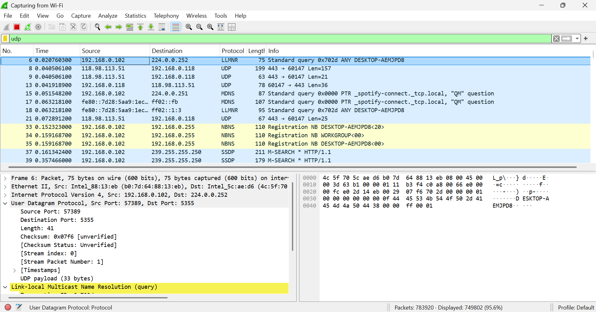

# Laporan Hasil Praktikum Jaringan Komputer Modul 5

## Tampilan Wireshark UDP

1. Jumlah dan nama field pada header UDP

Header UDP terdiri dari 4 field, yaitu:
- Source Port
- Destination Port
- Length
- Checksum

2. Panjang masing-masing field pada header UDP
Setiap field pada header UDP memiliki panjang sebagai berikut:
Source Port = 2 byte
Destination Port = 2 byte
Length = 2 byte
Checksum = 2 byte
Sehingga total panjang header UDP adalah 8 byte.

3. Arti nilai pada field “Length”
Field Length menunjukkan total panjang dari segmen UDP, yang mencakup:
- Header UDP
- Data (payload)
Nilai ini dapat diverifikasi pada Wireshark dengan membandingkan nilai Length dengan ukuran keseluruhan data dalam paket UDP.

4. Jumlah maksimum byte dalam payload UDP
Field Length memiliki ukuran 2 byte (16 bit), sehingga nilai maksimum yang dapat direpresentasikan adalah:
2¹⁶ − 1 = 65535 byte
Karena panjang header UDP adalah 8 byte, maka maksimum payload UDP adalah:
65535 − 8 = 65527 byte

5. Nomor port terbesar yang dapat digunakan
Nomor port pada UDP menggunakan 16 bit, sehingga nilai maksimum yang dapat digunakan adalah:
65535

6. Nomor protokol UDP
Nomor protokol untuk UDP adalah:
Desimal: 17
Heksadesimal: 0x11
Nilai ini dapat dilihat pada bagian Protocol dalam header IP di Wireshark.

7. Hubungan nomor port pada paket request dan response
Pada komunikasi UDP, terdapat hubungan antara nomor port pada paket permintaan dan balasan, yaitu:
- Source port pada paket pertama akan menjadi destination port pada paket balasan 
- Destination port pada paket pertama akan menjadi source port pada paket balasan
Hal ini menunjukkan bahwa nomor port pada paket request dan response saling bertukar (swap).
