# Hasil Praktikum Jaringan Komputer 1 - Installasi Wireshark

## Installasi Wireshark
1. File Installer: Menampilkan file eksekutif (installer) Wireshark versi 4.6.4 untuk sistem operasi Windows 64-bit yang telah selesai diunduh.

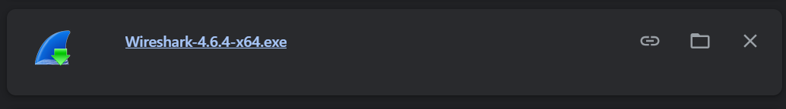

2. Jendela Selamat Datang: Halaman awal Setup Wizard yang menyarankan pengguna untuk menutup aplikasi Wireshark versi lama (jika ada) sebelum melanjutkan proses instalasi.

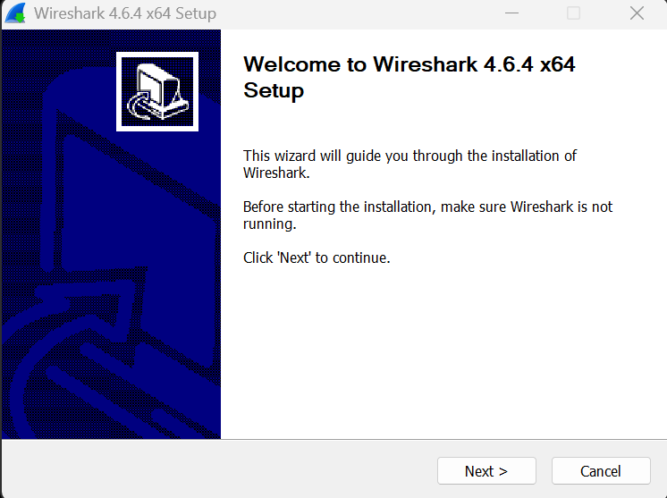

3. Persetujuan Lisensi: Menampilkan informasi lisensi GNU General Public License. Pengguna harus menekan tombol "Noted" untuk menyatakan memahami aturan distribusi perangkat lunak bebas ini.

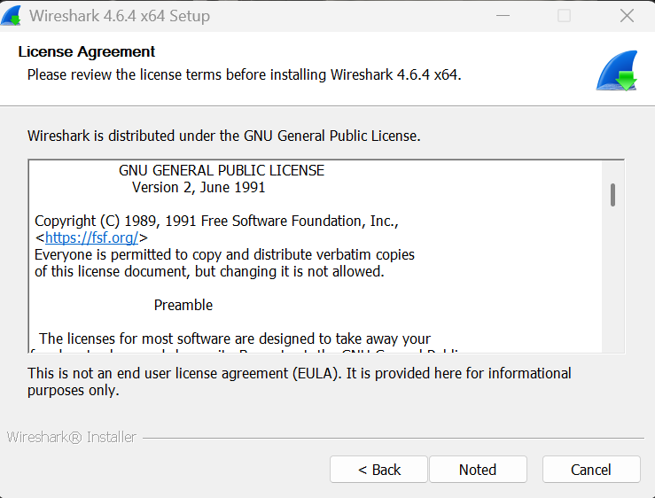

4. Informasi Sertifikasi: Penawaran opsional bagi pengguna untuk mempelajari program Wireshark Certified Analyst (WCA) bagi mereka yang ingin menggunakan aplikasi ini secara profesional.

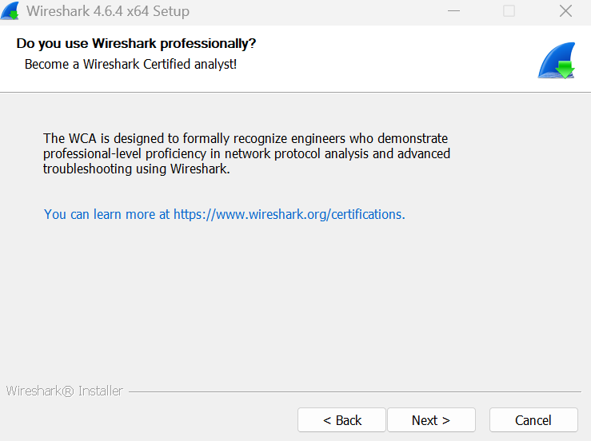

5. Pemilihan Komponen: Memilih fitur yang akan dipasang. Di sini terlihat komponen utama seperti Wireshark, TShark, dan berbagai External capture tools terpilih secara default.

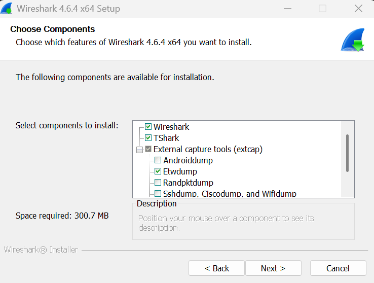

6. Tugas Tambahan: Pengaturan untuk membuat shortcut di Start Menu serta mengasosiasikan berbagai ekstensi file trace (seperti .pcap, .cap, dll.) agar otomatis terbuka dengan Wireshark.

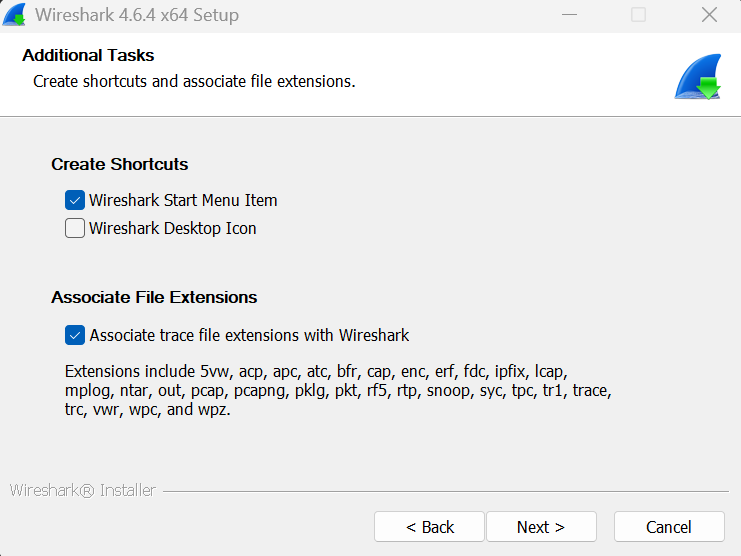

7. Lokasi Instalasi: Menentukan direktori penyimpanan file program. Secara default berada di C:\Program Files\Wireshark\. Terlihat juga informasi kapasitas penyimpanan yang diperlukan.

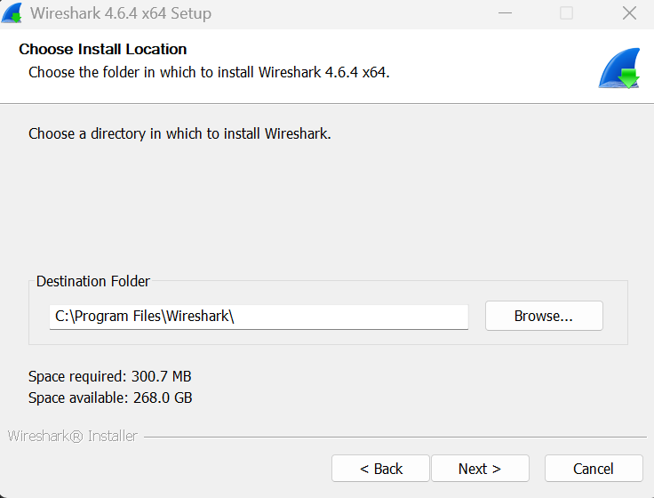

8. Konfigurasi Npcap: Wireshark mendeteksi bahwa Npcap 1.86 sudah terpasang di sistem. Npcap adalah komponen wajib untuk menangkap lalu lintas jaringan secara langsung (live).

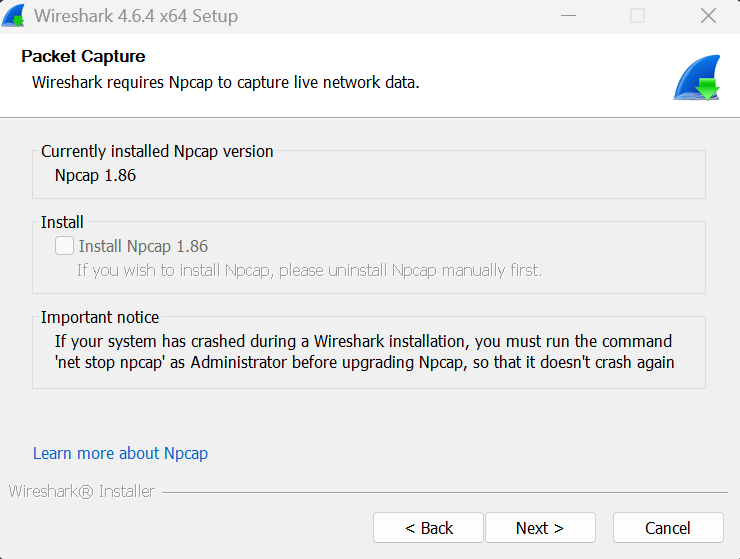

9. Konfigurasi USBPcap: Opsi untuk memasang USBPcap jika pengguna ingin menangkap lalu lintas data dari perangkat USB. Pada foto ini, opsi tidak dicentang (tidak dipasang).

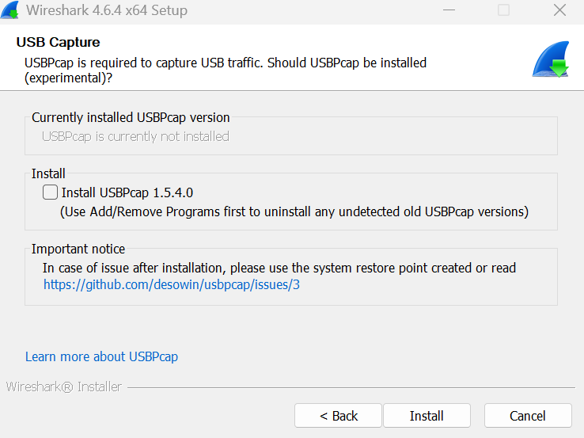

10. Proses Ekstraksi & Instalasi: Menunjukkan progres bar saat installer sedang mengekstrak file-file konfigurasi dan library ke dalam sistem komputer.

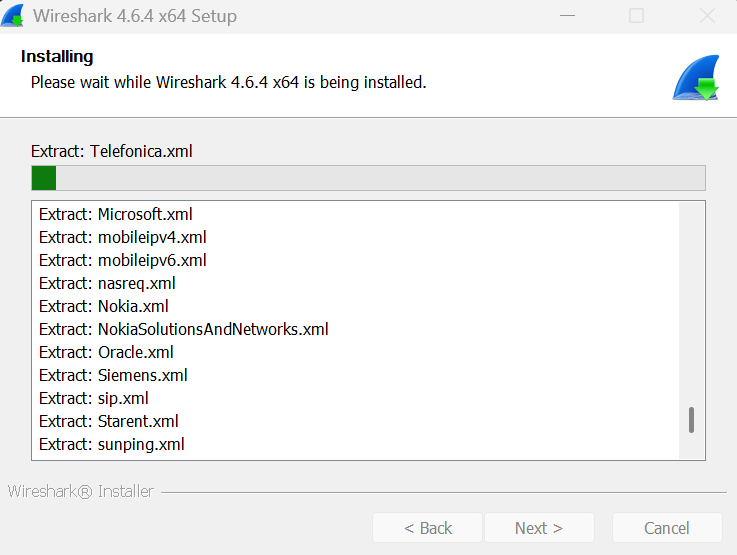

11. Instalasi Selesai: Menampilkan jendela konfirmasi bahwa Wireshark 4.6.4 telah berhasil terpasang di komputer. Pengguna dapat menekan tombol "Finish" untuk menutup wizard.

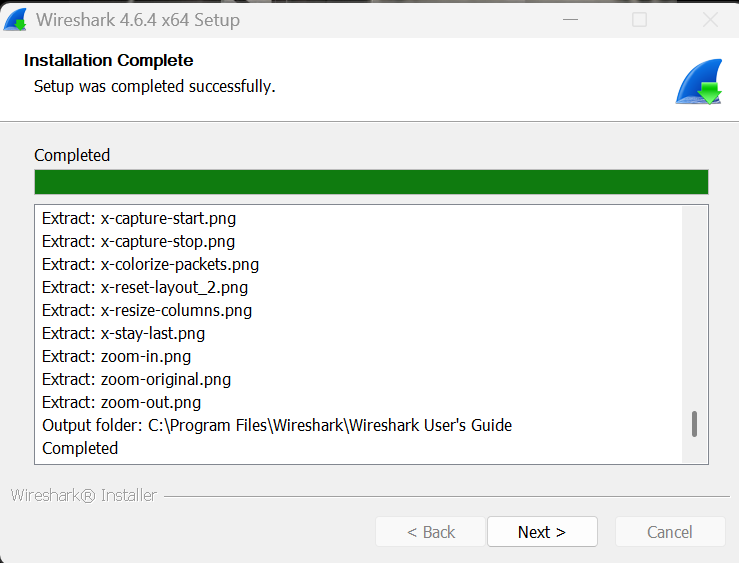
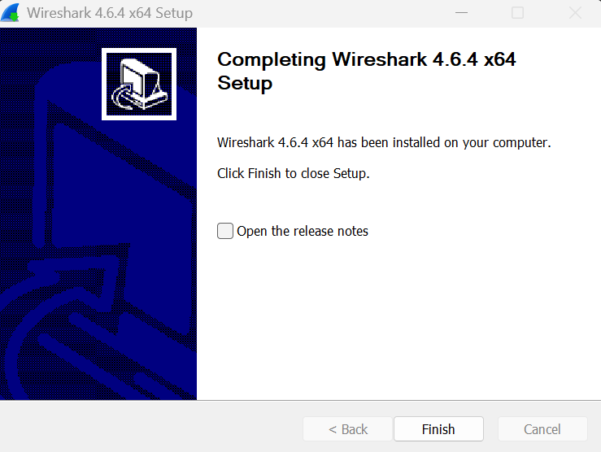

12. Tampilan Utama Wireshark: Antarmuka awal aplikasi yang menampilkan daftar interface jaringan yang tersedia (seperti Wi-Fi dan Ethernet). Terlihat grafik aktivitas pada interface Wi-Fi yang menandakan adanya lalu lintas data.

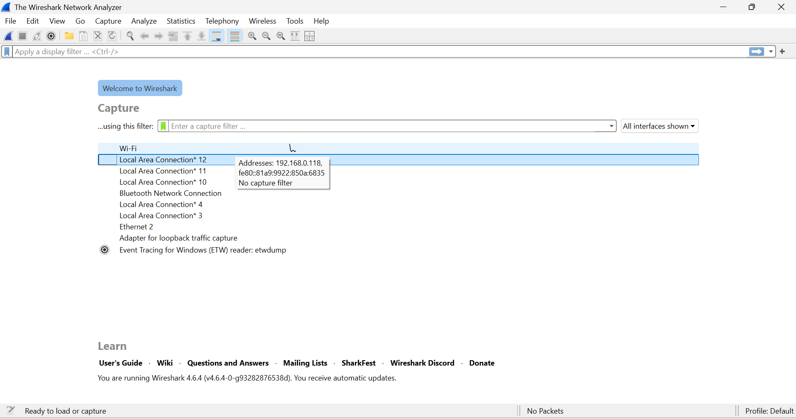

13. Aktivitas Capturing: Menunjukkan proses penangkapan paket data secara langsung (live capture). Panel atas menampilkan daftar paket yang lewat, panel tengah detail protokol, dan panel bawah menampilkan data dalam format Hex.

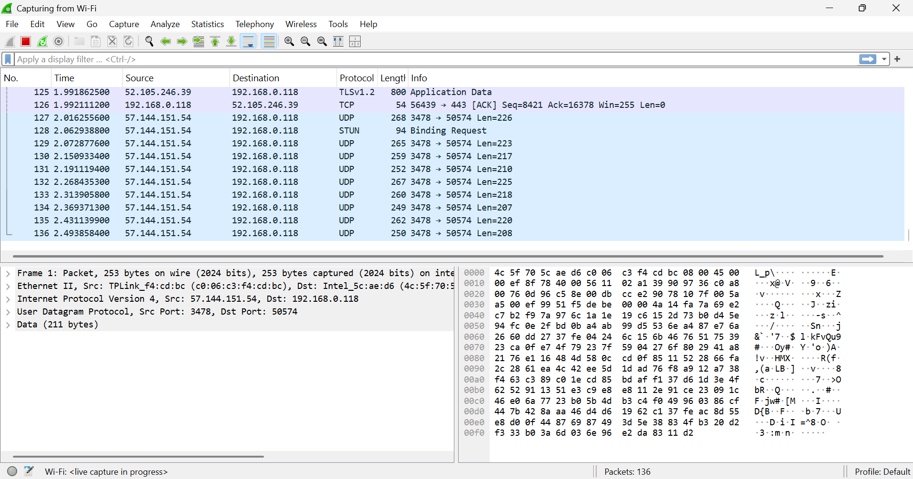

14. Menu Capture: Pengguna mengakses menu "Capture" dan memilih sub-menu "Options" untuk mengatur konfigurasi penangkapan data secara lebih spesifik.

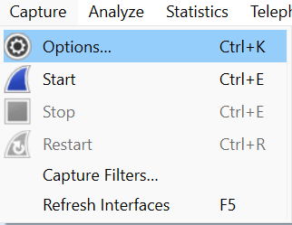

15. Jendela Capture Options: Klik bagian Wi-Fi sebanyak 2 kali, lalu Start.

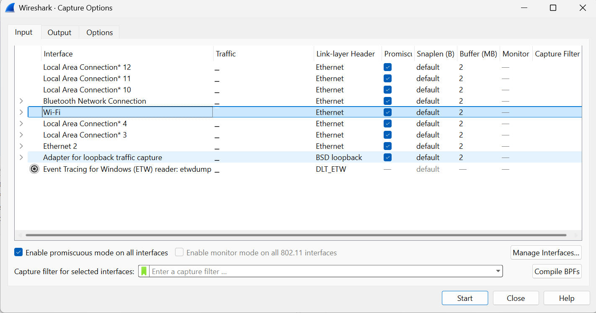

16. Peringatan Unsaved Packets: Pilih "Continue without Saving".

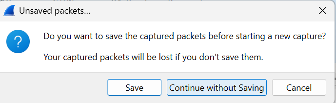

17. Penerapan Filter: Menampilkan kolom Display Filter yang diisi dengan kata kunci "http". Warna hijau pada kolom menandakan bahwa sintaks filter yang dimasukkan sudah benar/valid.

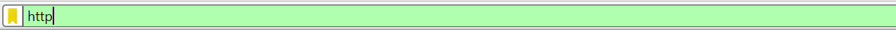

18. Akses Website Target: Percobaan mengakses halaman web khusus (wireshark-labs) melalui peramban (browser) untuk menghasilkan lalu lintas data HTTP yang akan ditangkap oleh Wireshark.

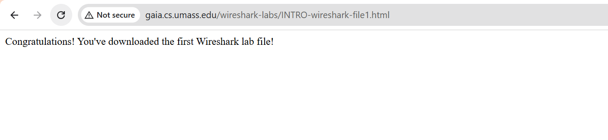

19. Hasil Filter HTTP: Menampilkan hasil penangkapan yang telah difilter. Terlihat paket GET (permintaan data ke server) dan respon 304 Not Modified, yang membuktikan bahwa komunikasi antara komputer dan server web berhasil terekam.

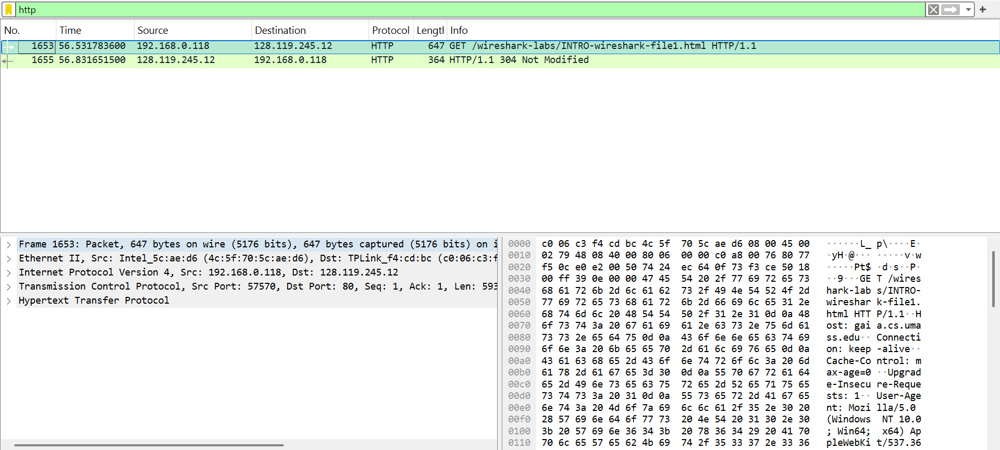
