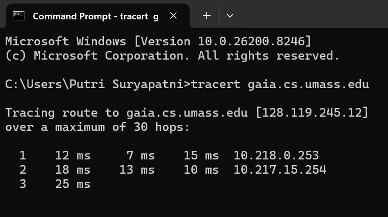
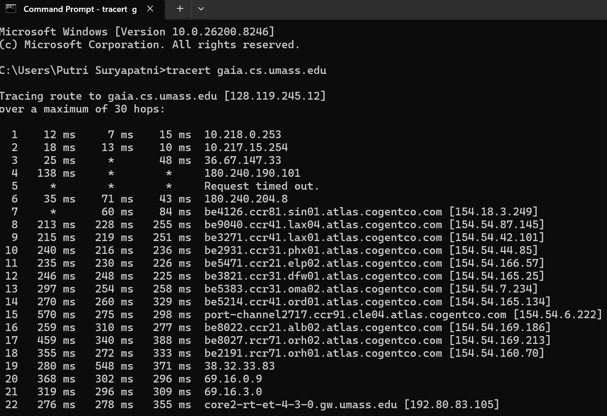
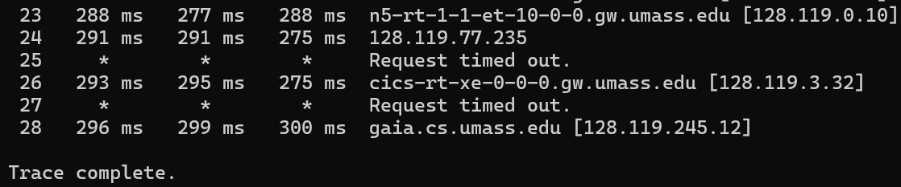
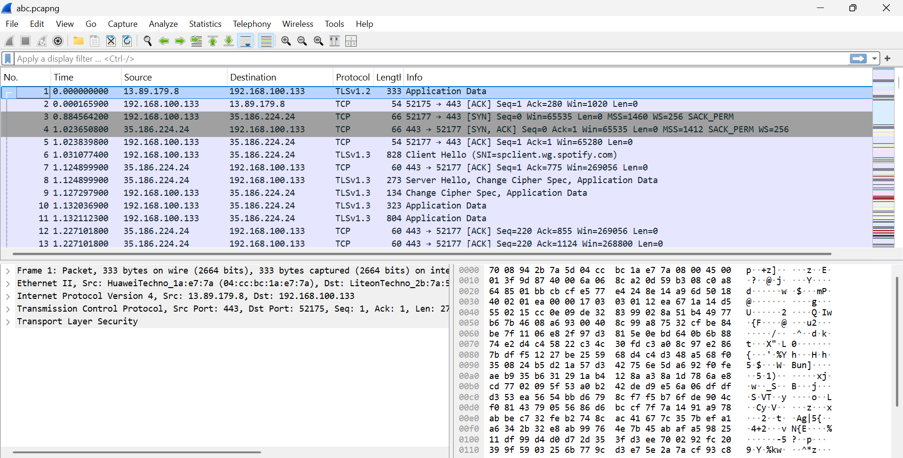
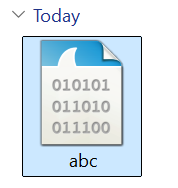
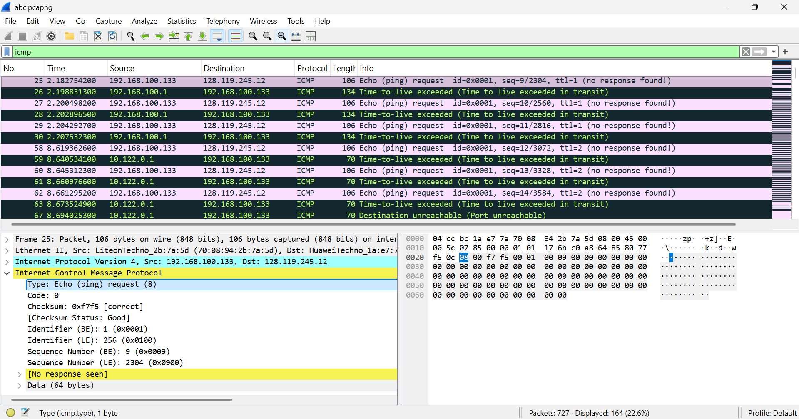
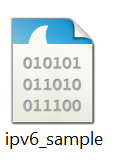
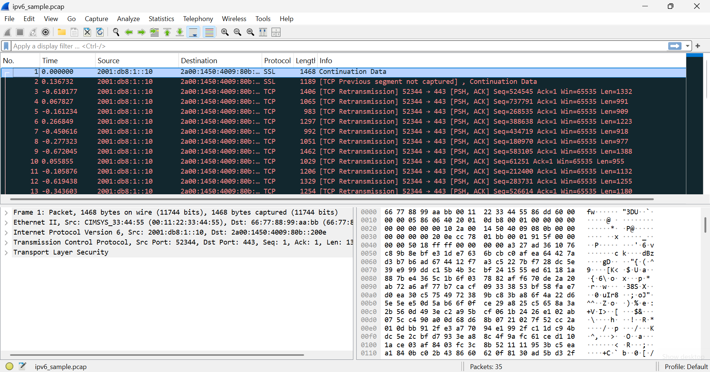
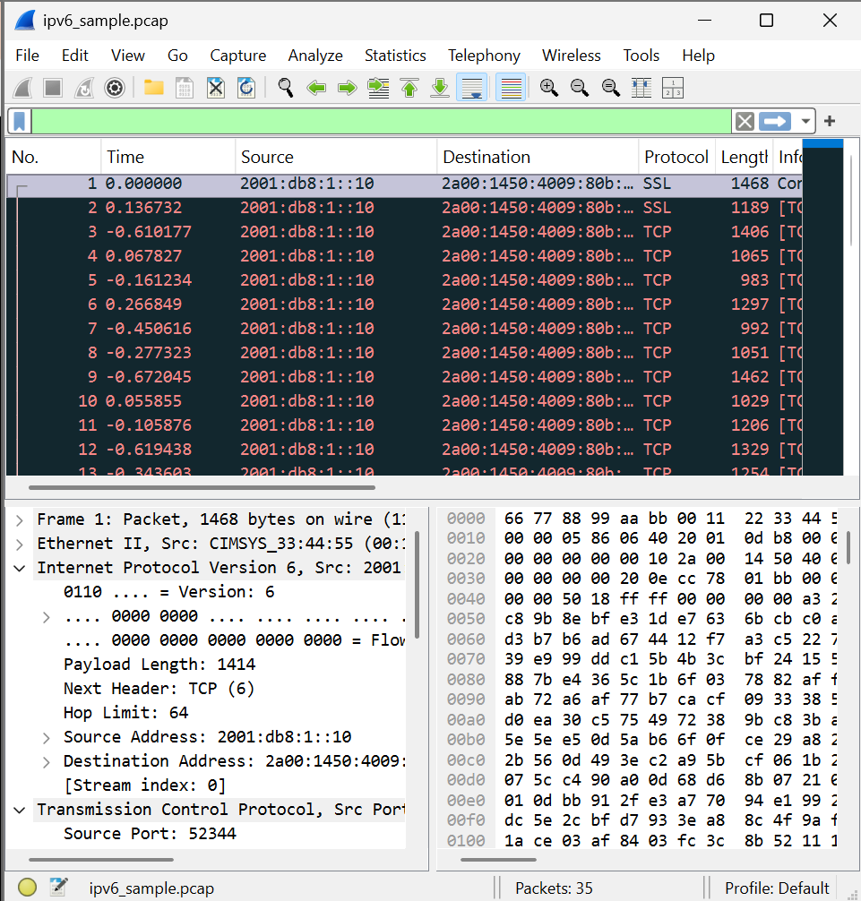
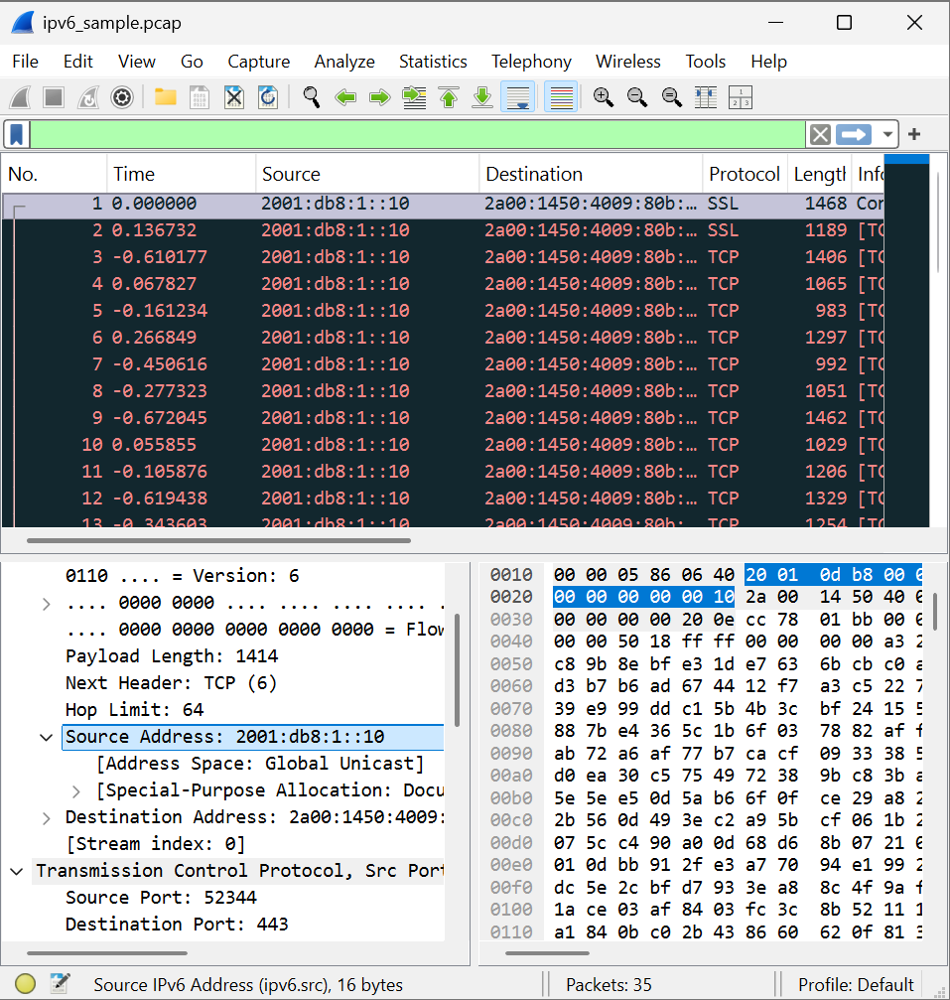

# Laporan Hasil Praktikum Jaringan Komputer Modul 10

## 1.Pengantar IP
IP (Internet Protocol) adalah protokol layer jaringan yang bertugas:
- Mengirim paket dari sumber ke tujuan
- Memberikan alamat logis (IP Address)
- Melakukan routing antar jaringan
- Mengatur fragmentasi paket jika ukuran terlalu besar

Pada praktikum ini digunakan:
- Wireshark → menangkap dan menganalisis paket
- Traceroute → melihat jalur paket menuju tujuan

## 2. Traceroute

Traceroute digunakan untuk:
- Mengetahui jalur router yang dilewati paket
- Mengukur waktu tempuh paket (RTT)
- Menganalisis komunikasi IP dan ICMP

Cara kerja traceroute:
- Mengirim paket dengan TTL kecil
- Router pertama mengurangi TTL menjadi 0
- Router mengirim ICMP Time Exceeded
- TTL dinaikkan bertahap sampai tujuan tercapai

## 3. IPv4 Dasar
Fungsi IPv4:
- Memberikan alamat perangkat
- Mengirim datagram antar host

Header IPv4
Field penting:
- Version
- Header Length
- Total Length
- Identification
- Flags
- Fragment Offset
- TTL
- Protocol
- Source IP
- Destination IP

TTL (Time To Live)
TTL:
- Menghindari looping paket
- Dikurangi 1 setiap melewati router
- Jika 0 → router mengirim ICMP Time Exceeded

## 4. Fragmentasi IP
Pengertian
Fragmentasi terjadi ketika:
- Ukuran paket lebih besar dari MTU jaringan
Maka paket dipecah menjadi beberapa fragment.

Field penting fragmentasi

Identification
Menandai bahwa beberapa fragment berasal dari paket yang sama.

Flags
- DF (Don’t Fragment)
- MF (More Fragment)

Fragment Offset
Menentukan posisi fragment pada paket asli.

## 5. IPv6

IPv6 adalah versi baru IP dengan:
- Alamat 128-bit
- Jumlah alamat jauh lebih besar
- Header lebih sederhana
- Tidak menggunakan fragmentasi router

## Bukti Screenshot Praktikum

