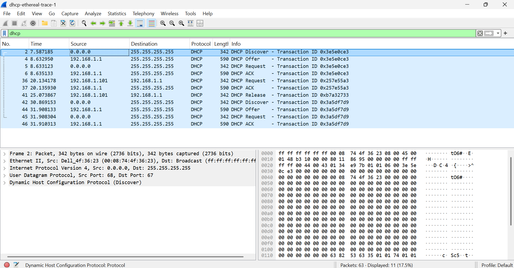

# Laporan Hasil Praktikum Jaringan Komputer Modul 11

Berdasarkan hasil capture Wireshark, proses DHCP berjalan menggunakan metode DORA (Discover, Offer, Request, ACK). Pertama client mengirim DHCP Discover dari alamat 0.0.0.0 ke 255.255.255.255 untuk mencari DHCP server. Kemudian server 192.168.1.1 membalas dengan DHCP Offer yang berisi penawaran IP address. Selanjutnya client mengirim DHCP Request untuk meminta IP tersebut. Terakhir server mengirim DHCP ACK sebagai tanda bahwa IP berhasil diberikan kepada client. DHCP berjalan menggunakan protokol UDP dengan port 67 pada server dan port 68 pada client.