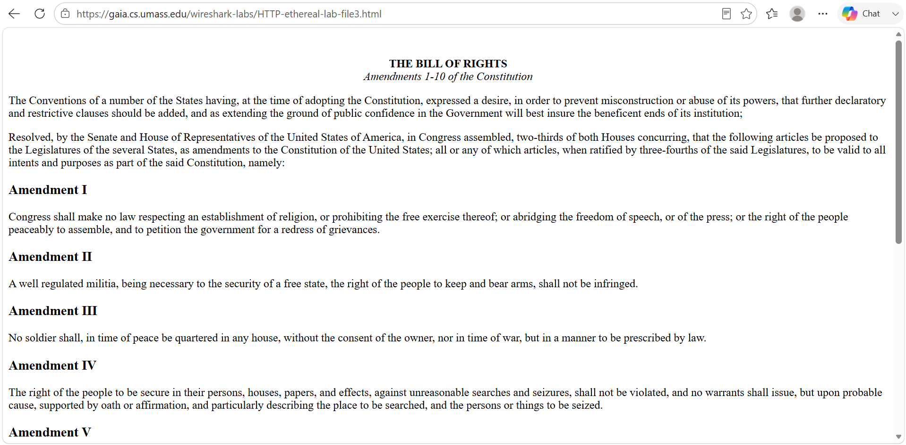
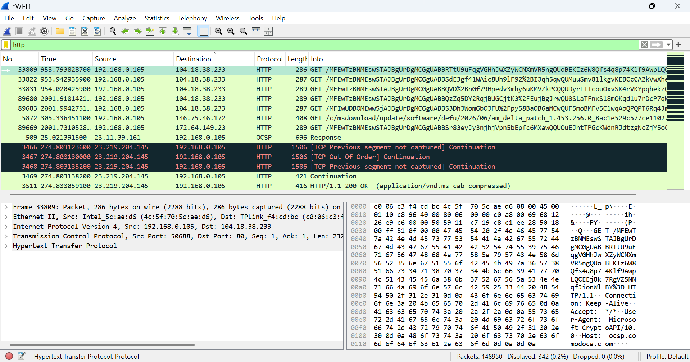
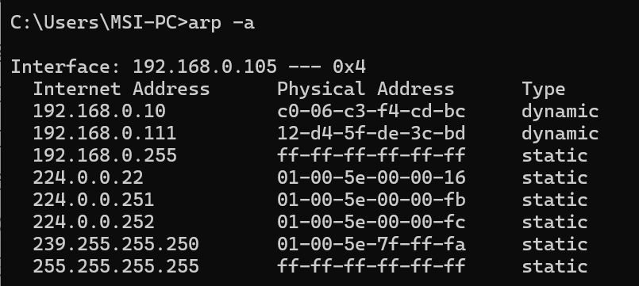
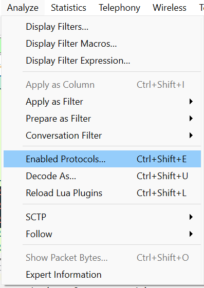
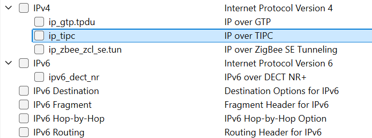
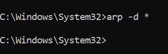
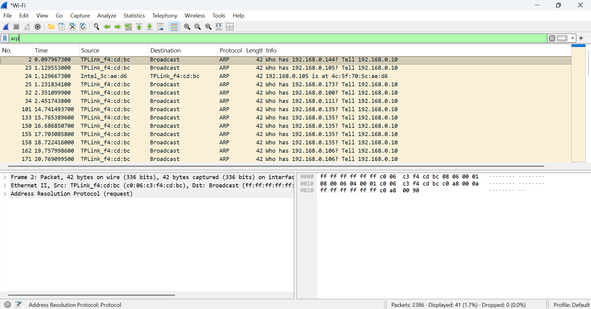

# Praktikum Modul 13

## Ida Ayu Putri Suryapatni Basundari (103072400068/IF 04-04)

Menampilkan proses saat praktikan mengakses tautan URL praktikum (seperti [http://gaia.cs.umass.edu/wireshark-labs/HTTP-wireshark-file3.html](http://gaia.cs.umass.edu/wireshark-labs/HTTP-wireshark-file3.html)) menggunakan web browser. Aktivitas ini memicu komputer klien untuk melakukan komunikasi data berbasis HTTP GET dengan server tujuan jarak jauh (remote server) guna mengunduh dan menampilkan halaman web tersebut.

Setelah proses pemuatan halaman web selesai, perekaman paket pada Wireshark dihentikan. Praktikan kemudian menerapkan filter kata kunci "http" pada kolom display filter. Filter ini berfungsi untuk menyaring dan mengisolasi paket data, sehingga Wireshark hanya menampilkan protokol HTTP (seperti baris HTTP GET dan HTTP Response 200 OK) untuk mempermudah analisis struktur frame pembungkusnya.

Menampilkan analisis detail pada bagian header Ethernet II untuk paket keluar (outbound) berupa HTTP GET. Berdasarkan hasil enkapsulasi data pada Lapisan Tautan (Data Link Layer), diperoleh informasi struktur sebagai berikut:  
- Destination Address: Menunjukkan MAC Address fisik milik Default Gateway (router lokal) yang bertugas meneruskan paket keluar dari jaringan lokal. 
-  Source Address: Menunjukkan MAC Address fisik dari kartu jaringan (NIC) komputer praktikan sendiri sebagai pengirim asal.
- Type: Bernilai 0x0800, yang mengindikasikan secara spesifik bahwa muatan (payload) di dalam frame Ethernet tersebut adalah paket berprotokol IPv4.  

Menampilkan ARP Cache

Menonaktifkan IP agar fokus ke Ethernet.

Menghapus ARP Cache

Menampilkan analisis mendalam pada panel detail paket terhadap struktur pesan protokol ARP. Terlihat interaksi dua arah yang krusial bagi komunikasi jaringan:  

- ARP Request (Opcode 1): Karena komputer praktikan belum mengetahui MAC Address dari Default Gateway (akibat efek pembersihan cache), komputer mengirimkan paket ARP Request bermetode broadcast. Alamat tujuan pada layer Ethernet diatur ke ff:ff:ff:ff:ff:ff agar paket diterima oleh semua perangkat di jaringan lokal untuk menanyakan pemilik IP target.  
- ARP Reply (Opcode 2): Perangkat Default Gateway yang mengenali IP miliknya kemudian membalas secara unicast (langsung ke komputer praktikan) dengan mengirimkan pesan ARP Reply yang memuat informasi MAC Address fisiknya. 

Setelah informasi alamat fisik ini didapatkan dan disimpan kembali ke dalam tabel ARP cache, barulah enkapsulasi frame Ethernet pada langkah 6 dan 7 dapat terbentuk sepenuhnya untuk mengirimkan data internet. 